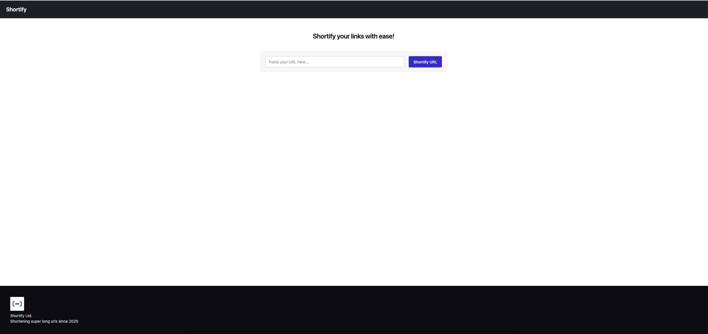

# Shortify UI

> Shorten your links with ease!

🌐 **Live:** [https://gray-hill-08d4fd703.6.azurestaticapps.net/](https://gray-hill-08d4fd703.6.azurestaticapps.net/)



## 🔗 Overview

Shortify UI is a React + Vite application that lets users paste a URL, shorten it via an API, and copy the resulting short link in one click. It's built with:

- **React** & **TypeScript**
- **Vite** for lightning-fast builds and development
- **Tailwind CSS** + **DaisyUI** for utility-first styling and pre-built components

## 🚀 Features

- Paste any long URL and generate a short link
- Copy shortened URLs to clipboard with a single click
- Responsive, minimalist design
- Loading and error states

## 📦 Tech Stack

| Tool         | Description                       |
| ------------ | --------------------------------- |
| React        | UI library                        |
| TypeScript   | JavaScript with static types      |
| Vite         | Build tool and development server |
| Tailwind CSS | Utility-first CSS framework       |
| DaisyUI      | Component library for Tailwind    |

## 🛠️ Prerequisites

- **Node.js** v14+
- **npm** (v6+) or **yarn**

## 🔧 Installation

1. **Clone the repo**
   ```bash
   git clone https://github.com/<your-org>/shortify-ui.git
   cd shortify-ui
   ```
2. **Install dependencies**
   ```bash
   npm install
   ```
3. **Configure environment variables**
   Create a `.env.local` file in the project root with:
   ```env
   VITE_API_BASE_URL=https://api.your-shortener.com
   ```

## 💻 Development

Run the development server with hot reload:

```bash
npm run dev
```

Open your browser at `http://localhost:5173` (or the port Vite reports).

## 📦 Build & Preview

- **Build for production:**

  ```bash
  npm run build
  ```

- **Preview production build locally:**
  ```bash
  npm run preview
  ```

## 📄 License

Distributed under the MIT License. See [LICENSE](./LICENSE) for more information.

## ✉️ Contact

Andriy Chernetskyy - andriy.chernetskyy99@outlook.com

Project Link: [https://github.com/AndriyChernetskyy/shortify-ui](https://github.com/AndriyChernetskyy/shortify-ui)
